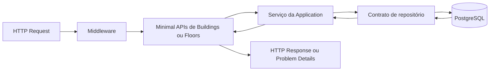

# Camada API

## Propósito

`SmartBuilding.Api` é a borda HTTP e o processo executável da aplicação. Ela recebe requests, valida o contrato de transporte, chama casos de uso e transforma resultados em respostas HTTP.

A API também é o composition root: o local onde abstrações são conectadas às implementações concretas.

## Estado atual

A API contém:

- host ASP.NET Core em .NET 10;
- geração do documento OpenAPI em ambiente de desenvolvimento;
- redirecionamento HTTPS;
- endpoint `GET /` para indicar que o processo está ativo;
- grupo de Minimal APIs em `/api/buildings` com listagem, consulta por ID, criação, substituição e remoção;
- grupo de Minimal APIs em `/api/floors` com as mesmas cinco operações CRUD;
- grupo de Minimal APIs em `/api/access-points` com as mesmas cinco operações CRUD;
- contratos HTTP próprios para requests e responses de `Building`, `Floor` e `AccessPoint`;
- validação automática com DataAnnotations e `AddValidation`;
- Problem Details para validação, conflitos e falhas inesperadas;
- referências para Application e Infrastructure;
- leitura obrigatória de `ConnectionStrings:SmartBuilding`;
- registro de Application por `AddApplication`;
- registro da persistência por `AddInfrastructure`;
- aplicação de migrations e seed apenas em `Development`.

Ainda não contém:

- CRUDs dos recursos seguintes do domínio, como cartões e permissões;
- processamento de pedidos de acesso, eventos, sessões de ocupação ou alertas;
- autenticação JWT;
- autorização por papéis;
- SignalR;
- Swagger UI interativo;
- health checks completos.

## Dependências

### Permitidas

- `SmartBuilding.Application` para executar casos de uso;
- `SmartBuilding.Infrastructure` para registrar implementações;
- ASP.NET Core e bibliotecas relacionadas ao transporte;
- configuração, logging, autenticação e observabilidade.

### Proibidas como responsabilidade

- implementar regras de concessão de acesso em endpoints;
- consultar `DbContext` diretamente em cada endpoint como padrão arquitetural;
- retornar entidades persistidas diretamente;
- guardar secrets no código ou em ficheiros versionados;
- considerar guards do frontend como autorização suficiente.

## Bootstrap atual

`Program.cs` executa estes passos:

```text
1. cria WebApplicationBuilder;
2. lê e valida ConnectionStrings:SmartBuilding;
3. registra OpenAPI, validação, Problem Details, Application e Infrastructure;
4. constrói a aplicação;
5. em Development, publica OpenAPI e inicializa o banco;
6. configura o tratamento global de erros, páginas de status e endpoints.
```

Se a connection string estiver ausente ou vazia, a API falha imediatamente com `InvalidOperationException`. Isso evita iniciar um processo parcialmente configurado. User Secrets está habilitado para desenvolvimento local e nenhum segredo foi versionado.

Em `Development`, `InitializeDevelopmentDatabaseAsync` executa migrations e o seed mínimo antes de a aplicação começar a servir requests. Nos demais ambientes, essa inicialização automática não ocorre.

O endpoint atual responde aproximadamente:

```json
{
  "name": "Smart Building API",
  "status": "Running"
}
```

Isoladamente, esse endpoint confirma apenas que o host iniciou. Na validação realizada em `Development`, o arranque anterior ao request também aplicou a migration e o seed com sucesso num PostgreSQL real.

## Fluxos implementados para Buildings e Floors



Os endpoints são finos: mapeiam requests para commands, chamam `IBuildingService` ou `IFloorService` e convertem os DTOs da Application em responses HTTP. Eles não usam `DbContext` diretamente.

## Composition root

A API registra a persistência sem conhecer os detalhes internos do contexto:

```csharp
builder.Services.AddInfrastructure(connectionString);
```

`AddInfrastructure` encapsula `AddDbContext`, `UseNpgsql` e `UseSnakeCaseNamingConvention`. O contexto mantém o lifetime scoped padrão do EF Core.

`AddApplication` registra `IBuildingService` e `IFloorService`, enquanto `AddInfrastructure` liga os contratos aos respetivos `BuildingRepository` e `FloorRepository`. A API conhece os dois lados apenas para realizar essa composição.

## Contratos HTTP

Os recursos usam substantivos plurais em kebab-case:

```text
/api/buildings
/api/floors
/api/access-points
/api/access/requests
/api/access/events
/api/occupancy/sessions
/api/security/alerts
```

DTOs devem representar explicitamente requests e responses. Entidades EF não devem ser serializadas diretamente, porque isso acopla o contrato público ao esquema interno e pode expor propriedades de navegação.

Os slices implementados expõem:

| Método e rota | Resultado de sucesso | Outros resultados |
|---|---|---|
| `GET /api/buildings` | `200 OK` com lista ordenada por nome | — |
| `GET /api/buildings/{id}` | `200 OK` com `BuildingResponse` | `404 Not Found` |
| `POST /api/buildings` | `201 Created`, body e header `Location` | `400 Bad Request` |
| `PUT /api/buildings/{id}` | `200 OK` com o estado substituído | `400 Bad Request`, `404 Not Found` |
| `DELETE /api/buildings/{id}` | `204 No Content` | `404 Not Found`, `409 Conflict` quando existem pisos |

| Método e rota | Resultado de sucesso | Outros resultados |
|---|---|---|
| `GET /api/floors` | `200 OK` com lista ordenada por edifício e número | — |
| `GET /api/floors/{id}` | `200 OK` com `FloorResponse` | `404 Not Found` |
| `POST /api/floors` | `201 Created`, body e header `Location` | `400 Bad Request`, `404 Not Found` quando o edifício não existe |
| `PUT /api/floors/{id}` | `200 OK` com o estado substituído | `400 Bad Request`, `404 Not Found` para piso ou edifício inexistente |
| `DELETE /api/floors/{id}` | `204 No Content` | `404 Not Found`, `409 Conflict` quando existem pontos de acesso ou sessões de ocupação |

| Método e rota | Resultado de sucesso | Outros resultados |
|---|---|---|
| `GET /api/access-points` | `200 OK` com lista ordenada por piso e nome | — |
| `GET /api/access-points/{id}` | `200 OK` com `AccessPointResponse` | `404 Not Found` |
| `POST /api/access-points` | `201 Created`, body e header `Location` | `400 Bad Request`, `404 Not Found` quando o piso não existe |
| `PUT /api/access-points/{id}` | `200 OK` com o estado substituído | `400 Bad Request`, `404 Not Found` para ponto ou piso inexistente |
| `DELETE /api/access-points/{id}` | `204 No Content` | `404 Not Found`, `409 Conflict` quando existem permissões, eventos ou alertas dependentes |

`CreateBuildingRequest` exige `Name` até 200 caracteres e `Address` até 500. `UpdateBuildingRequest` possui os mesmos limites e também exige `IsActive`. `BuildingResponse` contém `Id`, `Name`, `Address`, `IsActive` e `CreatedAt`.

`CreateFloorRequest` e `UpdateFloorRequest` exigem `BuildingId`, `Number` e `Name` não vazio com até 100 caracteres; a atualização também exige `IsActive`. `FloorResponse` contém `Id`, `BuildingId`, `Number`, `Name` e `IsActive`.

`CreateAccessPointRequest` e `UpdateAccessPointRequest` exigem `FloorId`, `Name` não vazio com até 150 caracteres e `Location` não vazia com até 250 caracteres; ambos incluem `SupportsEntry` e `SupportsExit`, e a atualização também exige `IsActive`. `AccessPointResponse` contém `Id`, `FloorId`, `Name`, `Location`, `IsActive`, `SupportsEntry`, `SupportsExit` e `CreatedAt`.

Os CRUDs de `Buildings`, `Floors` e `AccessPoints` estão implementados nesta branch. O processamento de acessos, cartões, permissões, eventos, ocupação e alertas continua planejado.

## Códigos de resposta

Os endpoints usam semântica HTTP consistente:

- `200 OK`: consulta ou operação concluída com representação;
- `201 Created`: criação de recurso;
- `204 No Content`: remoção sem corpo;
- `400 Bad Request`: contrato inválido;
- `401 Unauthorized`: autenticação ausente ou inválida;
- `403 Forbidden`: identidade válida sem permissão;
- `404 Not Found`: recurso inexistente;
- `409 Conflict`: violação de unicidade ou conflito de estado;
- `500 Internal Server Error`: falha inesperada tratada globalmente.

## Tratamento de erros

`AddProblemDetails`, `UseExceptionHandler` e `ApiExceptionHandler` formam o tratamento global. Somente `ApplicationValidationException`, exceção específica da Application, vira `400 Bad Request`; o handler preserva o nome da propriedade e produz `ValidationProblemDetails` com erros por campo. Exceções inesperadas viram `500 Internal Server Error` e são registradas no log, sem expor stack trace.

O bloqueio de remoção de um edifício com pisos, de um piso com pontos de acesso ou sessões de ocupação, e de um ponto de acesso com permissões, eventos ou alertas são conflitos de estado conhecidos. Os endpoints retornam `409 Conflict` com Problem Details. A criação ou atualização de um piso cujo `BuildingId` não existe retorna `404` com Problem Details; de forma equivalente, criar ou atualizar um ponto de acesso com `FloorId` inexistente retorna `404`. Recursos desconhecidos também retornam `404`. Respostas vazias `404` e outros status sem body passam por `UseStatusCodePages` para manter o formato de erro consistente. Os contratos OpenAPI declaram `ValidationProblemDetails` para `400` e Problem Details para `404` e `409`.

## Validação

A API valida o formato do transporte com DataAnnotations e `AddValidation`. Campos ausentes, valores compostos apenas por whitespace e comprimentos inválidos produzem `ValidationProblemDetails` com `400 Bad Request` e erros associados a cada campo. Nos contratos de `Floor`, o nome aceita no máximo 100 caracteres e o número pode ser negativo para representar pisos subterrâneos. A Application também normaliza espaços e protege os requisitos para chamadas que não atravessem HTTP, incluindo a rejeição de `Guid.Empty` como `BuildingId`.

No smoke test de `Buildings` com PostgreSQL real, as respostas de validação, recurso inexistente e conflito foram confirmadas, respetivamente, como `400`, `404` e `409`, todas com content type `application/problem+json`. O smoke de `Floors` confirmou listagem `200`, criação `201`, consulta `200`, atualização `200`, edifício pai inexistente `404`, conflito de remoção `409`, remoção `204` e limpeza do edifício temporário `204`. Para `AccessPoints`, o smoke confirmou listagem/criação/consulta/atualização com `200/201/200/200`, piso pai inexistente `404`, delete bloqueado por evento dependente `409` e, após limpar o evento, delete `204`; os recursos temporários foram limpos.

## OpenAPI e Swagger

`MapOpenApi` publica o documento somente em Development. Os endpoints de `Buildings` e `Floors` declaram nomes, resumos, tipos de sucesso e status alternativos para geração code-first. Uma UI interativa ainda não foi adicionada.

Cada endpoint futuro deve documentar tipos de resposta, status possíveis, autenticação e exemplos úteis.

## Autenticação e autorização

Planejado para fase própria:

- login com password verificada por hash;
- emissão de JWT;
- papéis `Admin` e `SecurityOperator`;
- policies aplicadas no servidor;
- endpoints protegidos por autorização.

JWT não deve carregar dados sensíveis. Autorização da API nunca deve depender apenas da interface Angular.

## Paginação

Eventos de acesso crescerão continuamente. Consultas de histórico devem exigir paginação e aceitar filtros sem carregar todo o conjunto em memória.

## SignalR

O futuro hub `/accessHub` notificará eventos, alertas e alterações de ocupação. SignalR pertence à borda da API; a decisão sobre quando publicar decorre dos casos de uso.

## Próximos passos

Os vertical slices de `Buildings`, `Floors` e `AccessPoints` estão implementados, incluindo CRUD, validação HTTP, Problem Details e requests manuais no ficheiro `.http`. O processamento de acessos e os CRUDs dos demais recursos, autenticação, autorização e a UI Swagger continuam planejados para as respetivas etapas.
