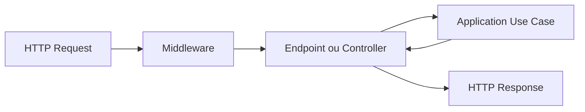

# Camada API

## Propósito

`SmartBuilding.Api` é a borda HTTP e o processo executável da aplicação. Ela recebe requests, valida o contrato de transporte, chama casos de uso e transforma resultados em respostas HTTP.

A API também é o composition root: o local onde abstrações são conectadas às implementações concretas.

## Estado atual

A API contém:

- host ASP.NET Core em .NET 10;
- geração do documento OpenAPI em ambiente de desenvolvimento;
- redirecionamento HTTPS;
- endpoint `GET /` para indicar que o processo está ativo;
- referências para Application e Infrastructure;
- leitura obrigatória de `ConnectionStrings:SmartBuilding`;
- registro da persistência por `AddInfrastructure`;
- aplicação de migrations e seed apenas em `Development`.

Ainda não contém:

- controllers ou grupos de endpoints do domínio;
- endpoints CRUD;
- autenticação JWT;
- autorização por papéis;
- middleware global de erros;
- SignalR;
- Swagger UI interativo;
- health checks completos.

## Dependências

### Permitidas

- `SmartBuilding.Application` para executar casos de uso;
- `SmartBuilding.Infrastructure` para registrar implementações;
- ASP.NET Core e bibliotecas relacionadas ao transporte;
- configuração, logging, autenticação e observabilidade.

### Proibidas como responsabilidade

- implementar regras de concessão de acesso em endpoints;
- consultar `DbContext` diretamente em cada endpoint como padrão arquitetural;
- retornar entidades persistidas diretamente;
- guardar secrets no código ou em ficheiros versionados;
- considerar guards do frontend como autorização suficiente.

## Bootstrap atual

`Program.cs` executa estes passos:

```text
1. cria WebApplicationBuilder;
2. lê e valida ConnectionStrings:SmartBuilding;
3. registra OpenAPI e Infrastructure;
4. constrói a aplicação;
5. em Development, publica OpenAPI e inicializa o banco;
6. configura middleware e endpoints.
```

Se a connection string estiver ausente ou vazia, a API falha imediatamente com `InvalidOperationException`. Isso evita iniciar um processo parcialmente configurado. User Secrets está habilitado para desenvolvimento local e nenhum segredo foi versionado.

Em `Development`, `InitializeDevelopmentDatabaseAsync` executa migrations e o seed mínimo antes de a aplicação começar a servir requests. Nos demais ambientes, essa inicialização automática não ocorre.

O endpoint atual responde aproximadamente:

```json
{
  "name": "Smart Building API",
  "status": "Running"
}
```

Isoladamente, esse endpoint confirma apenas que o host iniciou. Na validação realizada em `Development`, o arranque anterior ao request também aplicou a migration e o seed com sucesso num PostgreSQL real.

## Fluxo futuro de request



O endpoint deve ser fino: mapear entrada, chamar o caso de uso e mapear o resultado.

## Composition root

A API registra a persistência sem conhecer os detalhes internos do contexto:

```csharp
builder.Services.AddInfrastructure(connectionString);
```

`AddInfrastructure` encapsula `AddDbContext`, `UseNpgsql` e `UseSnakeCaseNamingConvention`. O contexto mantém o lifetime scoped padrão do EF Core.

Depois, contratos de Application serão registrados com implementações de Infrastructure. A API conhece os dois lados apenas para realizar essa composição.

## Contratos HTTP

Os recursos usam substantivos plurais em kebab-case:

```text
/api/buildings
/api/floors
/api/access-points
/api/access/requests
/api/access/events
/api/occupancy/sessions
/api/security/alerts
```

DTOs devem representar explicitamente requests e responses. Entidades EF não devem ser serializadas diretamente, porque isso acopla o contrato público ao esquema interno e pode expor propriedades de navegação.

## Códigos de resposta

Os endpoints devem usar semântica HTTP consistente:

- `200 OK`: consulta ou operação concluída com representação;
- `201 Created`: criação de recurso;
- `204 No Content`: atualização ou remoção sem corpo;
- `400 Bad Request`: contrato inválido;
- `401 Unauthorized`: autenticação ausente ou inválida;
- `403 Forbidden`: identidade válida sem permissão;
- `404 Not Found`: recurso inexistente;
- `409 Conflict`: violação de unicidade ou conflito de estado;
- `500 Internal Server Error`: falha inesperada tratada globalmente.

## Tratamento de erros

Erros inesperados devem ser convertidos para Problem Details sem stack trace. Logs internos devem conter contexto e `traceId`, mas nunca passwords, hashes, tokens completos ou segredos.

## Validação

A API valida o formato do transporte: JSON, campos obrigatórios, identificadores e limites básicos. Regras de negócio permanecem em Domain/Application.

## OpenAPI e Swagger

Atualmente `MapOpenApi` publica o documento OpenAPI somente em Development. Uma UI interativa ainda deverá ser adicionada na fase da API.

Cada endpoint futuro deve documentar tipos de resposta, status possíveis, autenticação e exemplos úteis.

## Autenticação e autorização

Planejado para fase própria:

- login com password verificada por hash;
- emissão de JWT;
- papéis `Admin` e `SecurityOperator`;
- policies aplicadas no servidor;
- endpoints protegidos por autorização.

JWT não deve carregar dados sensíveis. Autorização da API nunca deve depender apenas da interface Angular.

## Paginação

Eventos de acesso crescerão continuamente. Consultas de histórico devem exigir paginação e aceitar filtros sem carregar todo o conjunto em memória.

## SignalR

O futuro hub `/accessHub` notificará eventos, alertas e alterações de ocupação. SignalR pertence à borda da API; a decisão sobre quando publicar decorre dos casos de uso.

## Próximos passos

A composição básica da persistência e a connection string da Fase 3 estão implementadas na branch atual. CRUD, validação HTTP e tratamento global de erros pertencem à Fase 4 e continuam planejados.
