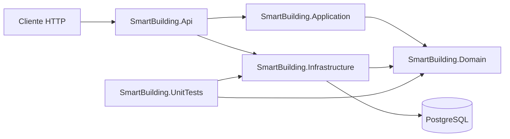
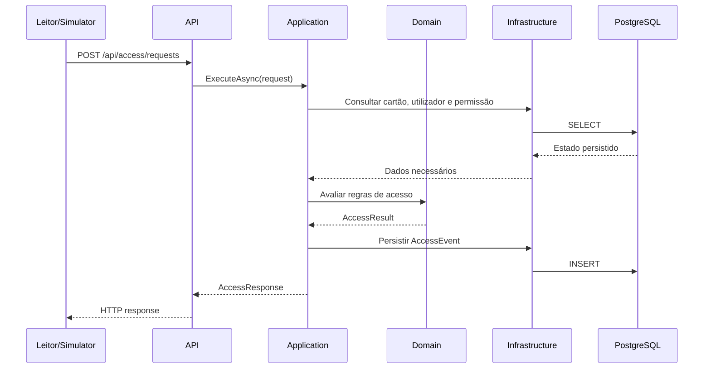

# Visão Geral da Arquitetura

## Objetivo

O Smart Building Access é uma plataforma para controlo de acessos e monitorização de ocupação. A arquitetura separa regras de negócio, orquestração, tecnologia de persistência e transporte HTTP para que cada parte possa evoluir e ser testada com menor acoplamento.

## Camadas atuais



As setas representam dependências de compilação ou uso. A camada apontada não conhece a camada de origem.

## Regra de dependência

As dependências devem apontar para o centro da aplicação:

```text
API ------------> Application ------------> Domain
  \                                      ^
   \-----------> Infrastructure ----------/
```

O Domain é o núcleo e não referencia nenhuma outra camada do sistema. Application conhece o Domain, mas não conhece API nem Infrastructure. Infrastructure conhece o Domain para realizar o mapeamento técnico. API funciona como composition root e conecta as partes.

## Responsabilidades

| Projeto | Responsabilidade principal | Estado |
|---|---|---|
| `SmartBuilding.Domain` | Vocabulário, estado e regras puras do negócio | Modelo estrutural implementado; comportamento ainda será evoluído |
| `SmartBuilding.Application` | Casos de uso, DTOs, contratos e orquestração | Estrutura criada; ainda sem casos de uso |
| `SmartBuilding.Infrastructure` | EF Core, PostgreSQL e implementações técnicas | Modelo, registro, migration inicial e seed de desenvolvimento implementados na branch atual |
| `SmartBuilding.Api` | Host HTTP, endpoints, autenticação e composição | Bootstrap, OpenAPI e composição da persistência implementados |
| `SmartBuilding.UnitTests` | Testes unitários, arquiteturais e de persistência | Testes arquiteturais, de metadados e de registro do contexto implementados |

## Fluxo atual

No estado atual, a API possui somente um endpoint de estado:

```text
GET /
  -> SmartBuilding.Api
  -> resposta { Name, Status }
```

Esse endpoint não executa casos de uso e não acessa banco de dados.

Antes de servir o endpoint, a API exige `ConnectionStrings:SmartBuilding`. Em `Development`, o bootstrap aplica migrations e executa o seed mínimo. Portanto, o request não consulta PostgreSQL, mas o arranque de desenvolvimento depende da inicialização bem-sucedida da persistência.

## Fluxo planejado de uma solicitação de acesso



Esse fluxo é planejado. Os casos de uso, contratos de persistência e endpoint ainda não foram implementados.

## Princípios arquiteturais

### Domínio independente

O Domain não pode depender de ASP.NET Core, EF Core, PostgreSQL, serialização, Docker ou detalhes de interface.

### Eventos brutos e estado derivado

`AccessEvent` representa um fato auditável. `OccupancySession` representa estado derivado desses eventos. Uma correção de ocupação não deve apagar ou reescrever o histórico bruto.

### Composition root na API

A API lê a connection string e chama `AddInfrastructure`, que registra `SmartBuildingDbContext` com Npgsql e convenção `snake_case`. Isso não significa que regras de negócio pertencem à API.

### Persistência como detalhe externo

EF Core traduz o modelo para PostgreSQL. Entidades do Domain não devem receber atributos ou comportamentos específicos do banco.

### Evolução por fases

Cada fase deve terminar com build, testes e um pull request focado. Tecnologias futuras não devem ser adicionadas antes de existir uma necessidade da fase atual.

## Estado por fase

| Fase | Estado resumido |
|---|---|
| Foundation | Concluída |
| Domain estrutural | Concluída pelo Definition of Done atual |
| Database | Persistência base implementada e validada na branch atual; entrega ainda em andamento |
| API funcional | Não iniciada; existe apenas o host |
| Access Control em diante | Não iniciado |

PostgreSQL 18 foi executado num container descartável, na porta isolada `55432`, somente para validar a migration, o arranque e a idempotência do seed. Isso não significa que a fase futura de Docker foi implementada.

Consulte [o plano do projeto](smart-building-project-plan.md) para todas as fases e critérios de conclusão.
