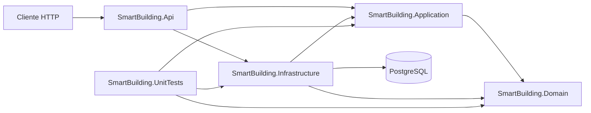
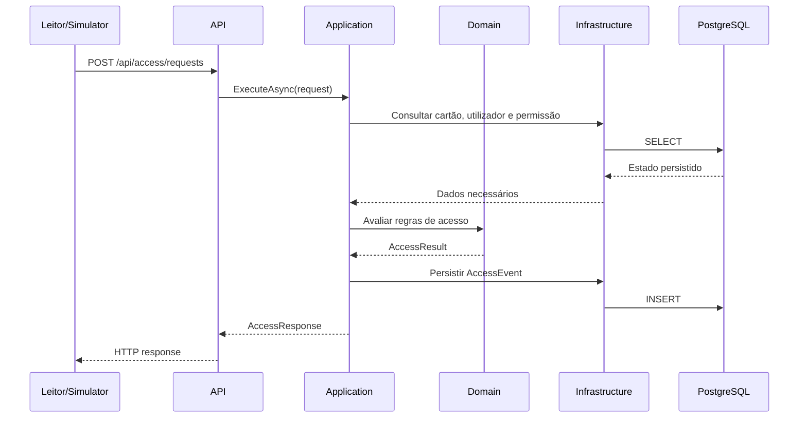

# Visão Geral da Arquitetura

## Objetivo

O Smart Building Access é uma plataforma para controlo de acessos e monitorização de ocupação. A arquitetura separa regras de negócio, orquestração, tecnologia de persistência e transporte HTTP para que cada parte possa evoluir e ser testada com menor acoplamento.

## Camadas atuais



As setas representam dependências de compilação ou uso. A camada apontada não conhece a camada de origem.

## Regra de dependência

As dependências devem apontar para o centro da aplicação:

```text
API ------------> Application ------------> Domain
  \                                      ^
   \-----------> Infrastructure ----------/
```

O Domain é o núcleo e não referencia nenhuma outra camada do sistema. Application conhece o Domain, mas não conhece API nem Infrastructure. Infrastructure conhece Domain e Application para mapear entidades e implementar contratos definidos pela Application. API funciona como composition root e conecta as partes.

## Responsabilidades

| Projeto | Responsabilidade principal | Estado |
|---|---|---|
| `SmartBuilding.Domain` | Vocabulário, estado e regras puras do negócio | Modelo estrutural implementado; comportamento ainda será evoluído |
| `SmartBuilding.Application` | Casos de uso, DTOs, contratos e orquestração | Serviços e contratos CRUD de `Buildings`, `Floors` e `AccessPoints` implementados |
| `SmartBuilding.Infrastructure` | EF Core, PostgreSQL e implementações técnicas | Persistência base e repositórios de `Building`, `Floor` e `AccessPoint` implementados |
| `SmartBuilding.Api` | Host HTTP, endpoints, autenticação e composição | Minimal APIs, validação e Problem Details dos três CRUDs implementados; autenticação planejada |
| `SmartBuilding.UnitTests` | Testes unitários, arquiteturais e de persistência | Testes existentes, nove casos de `BuildingService`, oito de `FloorService` e dez de `AccessPointService` |

## Fluxo atual

Além do endpoint de estado, os fluxos verticais implementados na Fase 4 atravessam todas as camadas:

```text
HTTP /api/buildings
HTTP /api/floors
HTTP /api/access-points
  -> requests e endpoints do recurso em SmartBuilding.Api
  -> serviço e contrato de repositório em SmartBuilding.Application
  -> repositório e SmartBuildingDbContext em SmartBuilding.Infrastructure
  -> PostgreSQL
```

Os fluxos implementam listagem, consulta por ID, criação, atualização e remoção de `Building`, `Floor` e `AccessPoint`. O delete de edifício retorna conflito quando há pisos associados. O delete de piso retorna conflito quando há pontos de acesso ou sessões de ocupação. O delete de ponto de acesso retorna conflito quando existem permissões, eventos ou alertas relacionados. As FKs também protegem contra dependências inseridas concorrentemente. Criação e atualização de pisos distinguem piso e edifício pai inexistentes; as operações de `AccessPoint` distinguem ponto e piso pai inexistentes.

Antes de servir endpoints, a API exige `ConnectionStrings:SmartBuilding`. Em `Development`, o bootstrap aplica migrations e executa o seed mínimo. O endpoint `GET /` continua sem acessar o banco, enquanto `/api/buildings`, `/api/floors` e `/api/access-points` usam a persistência PostgreSQL.

Os CRUDs administrativos de `Buildings`, `Floors` e `AccessPoints` estão implementados. A decisão de conceder ou negar acesso e o processamento de eventos/ocupação/alertas, além dos demais recursos, permanecem planejados.

## Fluxo planejado de uma solicitação de acesso



Esse fluxo é planejado. Os casos de uso, contratos de persistência e endpoint ainda não foram implementados.

## Princípios arquiteturais

### Domínio independente

O Domain não pode depender de ASP.NET Core, EF Core, PostgreSQL, serialização, Docker ou detalhes de interface.

### Eventos brutos e estado derivado

`AccessEvent` representa um fato auditável. `OccupancySession` representa estado derivado desses eventos. Uma correção de ocupação não deve apagar ou reescrever o histórico bruto.

### Composition root na API

A API lê a connection string e chama `AddInfrastructure`, que registra `SmartBuildingDbContext` com Npgsql e convenção `snake_case`. Isso não significa que regras de negócio pertencem à API.

### Persistência como detalhe externo

EF Core traduz o modelo para PostgreSQL. Entidades do Domain não devem receber atributos ou comportamentos específicos do banco.

### Evolução por fases

Cada fase deve terminar com build, testes e um pull request focado. Tecnologias futuras não devem ser adicionadas antes de existir uma necessidade da fase atual.

## Estado por fase

| Fase | Estado resumido |
|---|---|
| Foundation | Concluída |
| Domain estrutural | Concluída pelo Definition of Done atual |
| Database | Persistência base implementada e validada |
| API funcional | CRUDs de `Buildings`, `Floors` e `AccessPoints` implementados; autorização e demais recursos planejados |
| Access Control em diante | Não iniciado |

PostgreSQL 18 foi executado num container descartável, na porta isolada `55432`, para validar a migration, o arranque, a idempotência do seed e os slices de `Buildings`, `Floors` e `AccessPoints`. O runtime de AccessPoints confirmou `200/201/200/200/404/409/204`, incluindo piso pai ausente, evento dependente e delete após limpar o evento. Isso não significa que a fase futura de Docker da aplicação foi implementada.

Consulte [o plano do projeto](smart-building-project-plan.md) para todas as fases e critérios de conclusão.
