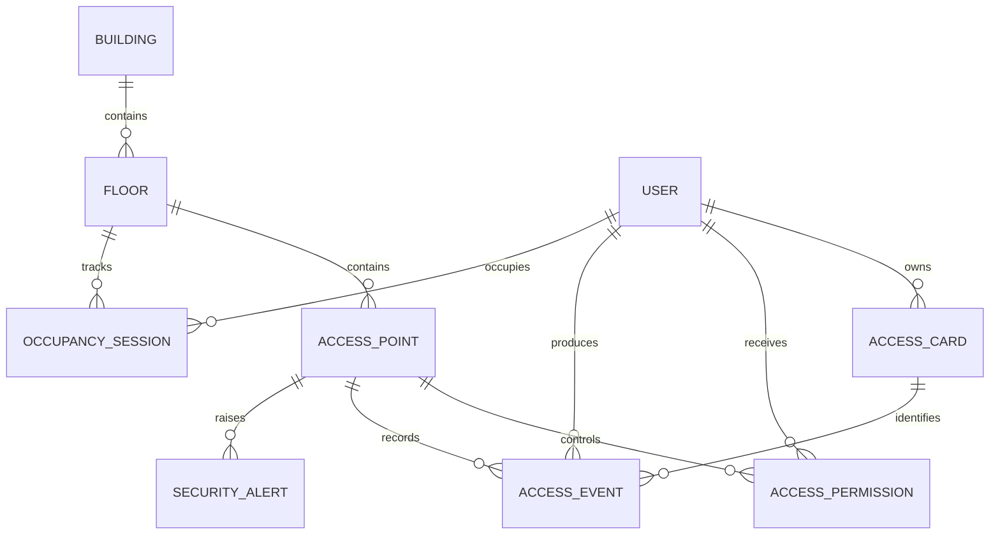

# Camada Domain

## Propósito

`SmartBuilding.Domain` representa o núcleo conceitual do sistema. A camada define os termos do negócio e deve continuar válida mesmo que PostgreSQL, ASP.NET Core ou Angular sejam substituídos.

## Dependências

### Permitidas

- biblioteca padrão do .NET;
- tipos internos do próprio Domain.

### Proibidas

- `SmartBuilding.Application`;
- `SmartBuilding.Infrastructure`;
- `SmartBuilding.Api`;
- Entity Framework Core e Npgsql;
- ASP.NET Core e tipos HTTP;
- atributos de persistência ou serialização usados para adaptar frameworks.

O teste arquitetural `DomainDependencyTests` protege parte dessa fronteira automaticamente.

## Estrutura atual

```text
SmartBuilding.Domain/
├── Entities/
│   ├── AccessCard.cs
│   ├── AccessEvent.cs
│   ├── AccessPermission.cs
│   ├── AccessPoint.cs
│   ├── Building.cs
│   ├── Floor.cs
│   ├── OccupancySession.cs
│   ├── SecurityAlert.cs
│   └── User.cs
└── Enums/
    ├── AccessDirection.cs
    ├── AccessResult.cs
    ├── AlertStatus.cs
    └── AlertType.cs
```

## Entidades

### Building

Representa um edifício. É a raiz estrutural que contém pisos. Possui nome, endereço, estado ativo e data de criação.

### Floor

Representa um piso dentro de um edifício. Relaciona-se com pontos de acesso e sessões de ocupação.

### AccessPoint

Representa um ponto físico controlado, como entrada principal, saída de piso ou acesso à sala de servidores. O termo correto é `AccessPoint`, e não `Door`, porque um ponto de controlo pode representar mais do que uma porta.

As propriedades `SupportsEntry` e `SupportsExit` indicam as direções físicas aceitas pelo ponto.

### User

Representa uma pessoa autorizada. Mantém os vínculos com cartões, permissões, eventos e sessões de ocupação. `PasswordHash` deve armazenar somente hash seguro, nunca password em texto puro.

### AccessCard

Representa um cartão ou badge. Um cartão pertence a um utilizador, pode ser desativado e pode expirar.

### AccessPermission

Representa a autorização de um utilizador para um ponto de acesso durante um intervalo de validade.

### AccessEvent

Representa uma tentativa de acesso, permitida ou negada. É um registro de auditoria e deve ser preservado.

`AccessCardId` e `UserId` são opcionais porque um cartão desconhecido não possui vínculos internos. `AccessPointId` é obrigatório porque a tentativa ocorreu num ponto conhecido pelo sistema.

### OccupancySession

Representa um intervalo derivado de permanência de um utilizador num piso. `ExitedAt == null` indica uma sessão aberta.

### SecurityAlert

Representa uma situação que exige investigação, como tentativas negadas repetidas ou uso de cartão expirado.

## Enums

### AccessDirection

- `Entry`: entrada.
- `Exit`: saída.

Direção não é resultado. Uma entrada pode ser concedida ou negada.

### AccessResult

Categoriza o resultado da avaliação: concedido, cartão inexistente, cartão inativo, cartão expirado, utilizador inativo, ponto inativo, ausência de permissão ou permissão expirada.

### AlertType e AlertStatus

Definem, respectivamente, a causa do alerta e o seu ciclo de tratamento: aberto, em investigação ou resolvido.

## Relações



## Estado atual versus comportamento planejado

Atualmente as entidades são modelos mutáveis com propriedades públicas, valores padrão e coleções de navegação. Elas representam corretamente a estrutura, mas ainda não encapsulam todas as invariantes.

Regras planejadas incluem:

- impedir acesso com cartão inativo ou expirado;
- validar `ValidFrom <= ValidUntil`;
- garantir `ExitedAt >= EnteredAt`;
- detectar segunda entrada com sessão já aberta;
- detectar saída sem sessão aberta;
- controlar transições válidas de `AlertStatus`.

Essas regras devem ser adicionadas juntamente com testes unitários. Não devem ser implementadas em controllers ou configurações EF.

## Datas e tempo

O código usa `DateTime.UtcNow` nos valores padrão. Novas operações devem trabalhar em UTC e converter para horário local somente nas bordas de apresentação.

Para testes determinísticos, regras dependentes do tempo devem receber o instante atual como argumento ou por uma abstração de relógio, evitando depender diretamente de `DateTime.UtcNow` durante a avaliação.

## Convenções

- tipos, membros e ficheiros em PascalCase;
- parâmetros e variáveis locais em camelCase;
- termos consistentes com o plano;
- coleções inicializadas para evitar referências nulas;
- nenhuma regra dependente de banco, HTTP ou UI.

## Próximos passos da camada

O Domain não precisa mudar para concluir o primeiro corte de persistência. Regras comportamentais devem entrar nas fases de Access Control e Occupancy, acompanhadas dos respectivos testes.
